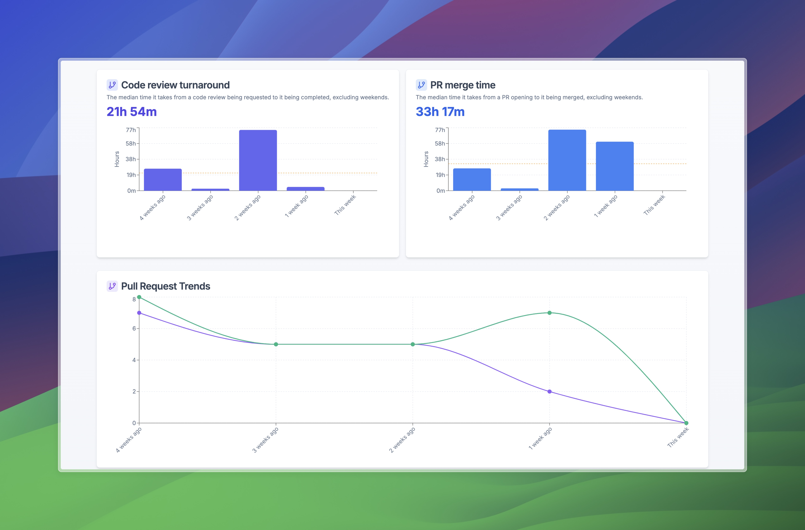

# CodeVigil

A Clojure backend service for GitHub repository pull request analysis.

**Frontend Dashboard Repository:** [parthmodi152/codevigil-dahsboard](https://github.com/parthmodi152/codevigil-dahsboard)

## Screenshots

Here are some screenshots of the CodeVigil dashboard:




## Overview

CodeVigil is a backend service that:
- Accepts GitHub repository URLs via an API endpoint
- Fetches pull requests from the last 4 weeks
- Enriches pull requests with reviews, review comments, and requested reviewers
- Stores all data in a PostgreSQL database

## Requirements

- Docker and Docker Compose
- GitHub Personal Access Token with `repo` scope

## Setup

1. Clone this repository
2. Create a `.env` file from the example:
   ```
   cp .env.example .env
   ```
3. Edit the `.env` file and add your GitHub token and database password:
   ```
   GITHUB_TOKEN=your_github_token_here
   DB_PASSWORD=your_secure_password_here
   ```
4. Build and start the services:
   ```
   docker-compose up -d
   ```

## API Usage

### Register a Repository

```
POST /api/repositories
Content-Type: application/json

{
  "repo_url": "https://github.com/owner/repo"
}
```

Response:
```json
{
  "status": "success",
  "repository": {
    "owner": "owner",
    "repo": "repo",
    "url": "https://github.com/owner/repo"
  },
  "pull_requests_count": 5
}
```

### Get Repositories

Retrieve a list of all registered repositories.

```
GET /api/repositories
```

Response:
```json
{
  "status": "success",
  "repositories": [
    {
      "owner": "owner1",
      "repo": "repo1",
      "url": "https://github.com/owner1/repo1",
      "last_checked_at": "2025-03-24T14:32:10Z"
    },
    {
      "owner": "owner2",
      "repo": "repo2",
      "url": "https://github.com/owner2/repo2",
      "last_checked_at": "2025-03-23T09:15:43Z"
    }
  ]
}
```

### Get Aggregated Metrics

Retrieve aggregated metrics for a repository over time (weekly or daily).

```
GET /api/repositories/{owner}/{repo}/metrics?aggregation={weekly|daily}
```

Example:
```
GET /api/repositories/Helicone/helicone/metrics?aggregation=weekly
```

Response:
```json
{
  "status": "success",
  "repository": {
    "owner": "Helicone",
    "repo": "helicone"
  },
  "aggregation": "weekly",
  "metrics": [
    {
      "total_prs": 29,
      "reviewed_prs": 29,
      "median_merge_time_seconds": 505,
      "merged_prs": 29,
      "median_merge_time": "8 minutes, 25 seconds",
      "end_date": "2025-03-24T00:00-04:00[America/Toronto]",
      "start_date": "2025-03-17T00:00-04:00[America/Toronto]",
      "period": "This week",
      "median_review_turnaround_seconds": 374,
      "median_review_turnaround": "6 minutes, 14 seconds"
    },
    {
      "total_prs": 45,
      "reviewed_prs": 45,
      "median_merge_time_seconds": 1150,
      "merged_prs": 37,
      "median_merge_time": "19 minutes, 10 seconds",
      "end_date": "2025-03-17T00:00-04:00[America/Toronto]",
      "start_date": "2025-03-10T00:00-04:00[America/Toronto]",
      "period": "1 week ago",
      "median_review_turnaround_seconds": 3878,
      "median_review_turnaround": "1 hours, 4 minutes"
    },
    // ... additional weeks ...
  ]
}
```

#### Available Metrics

| Metric | Description |
|--------|-------------|
| total_prs | Total number of PRs in the period |
| reviewed_prs | Number of PRs that received at least one review |
| merged_prs | Number of PRs that were merged |
| median_merge_time | Median time from PR creation to merge (formatted) |
| median_merge_time_seconds | Median time from PR creation to merge (in seconds) |
| median_review_turnaround | Median time from PR creation to first review (formatted) |
| median_review_turnaround_seconds | Median time from PR creation to first review (in seconds) |
| start_date | Start date of the period |
| end_date | End date of the period |
| period | Human-readable description of the period |

## Development

### Prerequisites

- JDK 17+
- Leiningen
- PostgreSQL

### Running Locally

1. Set environment variables:
   ```
   export GITHUB_TOKEN=your_github_token_here
   export DB_HOST=localhost
   export DB_PORT=5432
   export DB_NAME=codevigil
   export DB_USER=postgres
   export DB_PASSWORD=your_password_here
   ```

2. Start the application:
   ```
   lein run
   ```

3. The API will be available at http://localhost:3000
   - Swagger UI: http://localhost:3000/swagger-ui

## Testing

Run the tests with:
```
lein test
```

## License

Copyright © 2025
